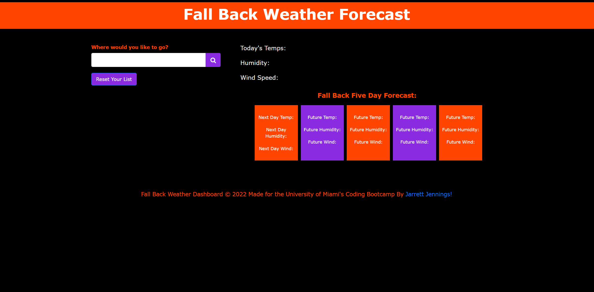
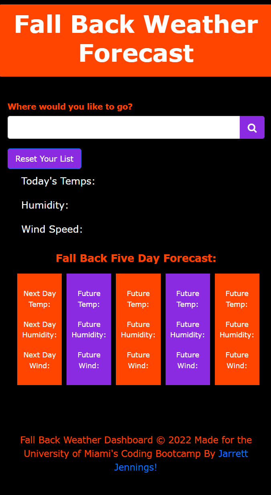
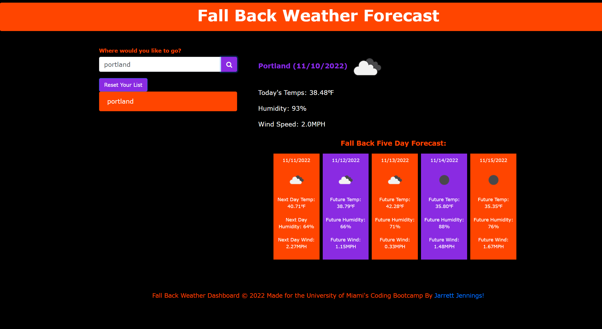
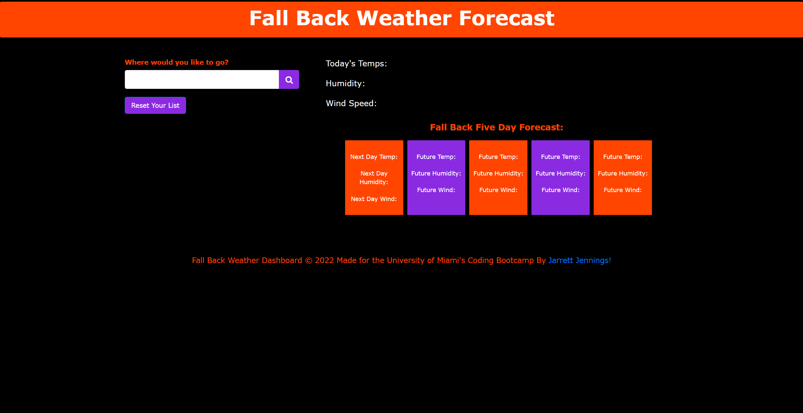

# whatstheweather
This is the repository for the seventh bootcamp challenge (Weather Dashboard).

## Description
This project entailed combining written HTML, CSS, JavaScript, and third-party sever-side APIs to create a 5-Day Weather forecast for cities.

## Usage:
AS A traveler, I want to see the weather outlook for multiple cities, so that I can plan a trip accordingly. Given a weather dashboard with form inputs when I search for a city, then I am presented with current and future conditions for that city and that city is added to the search history. When I view current weather conditions for that city, then I am presented with the city name, the date, an icon representation of weather conditions, the temperature, the humidity, and the the wind speed. When I view future weather conditions for that city, then I am presented with a 5-day forecast that displays the date, an icon representation of weather conditions, the temperature, the wind speed, and the humidity. When I click on a city in the search history, then I am again presented with current and future conditions for that city.

### Desktop Screen

### Smaller Screen

### City Forecast

### City Forecast

## Link to deployed webpage: 
https://codingjarrett.github.io/whatstheweather/

## License
Please refer to the GitHub Repository for licensing information. Link to GitHub repository: https://github.com/codingjarrett/whatstheweather
